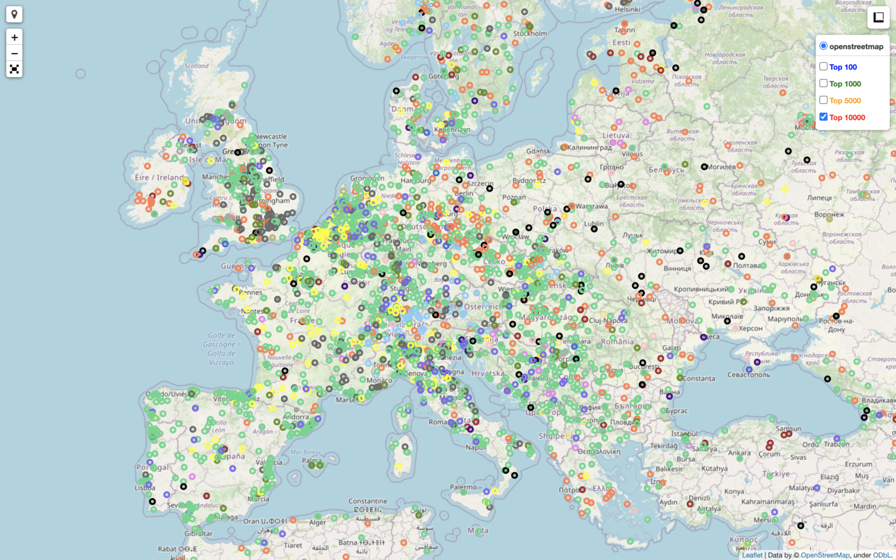
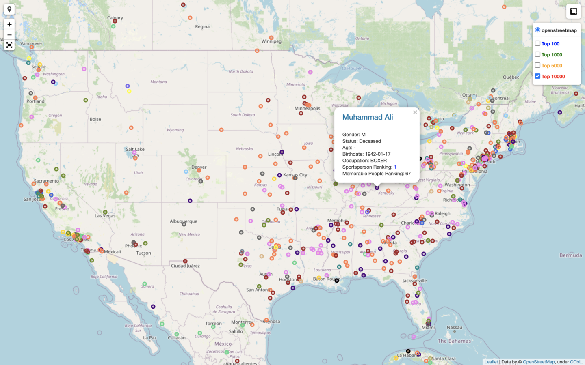
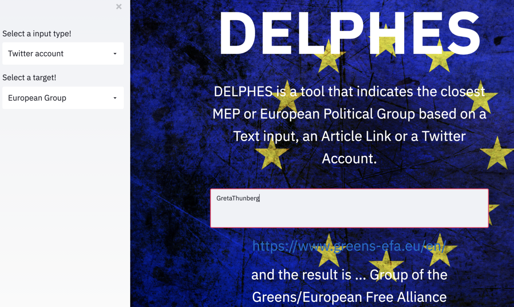
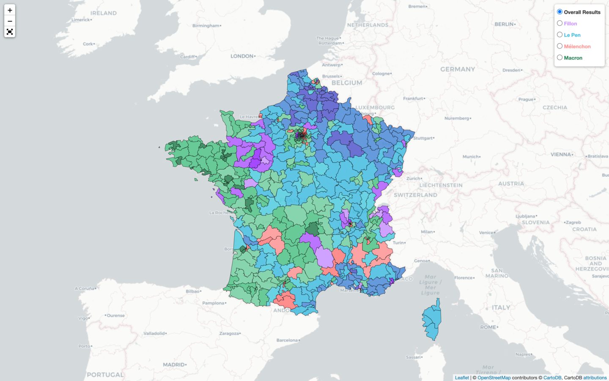
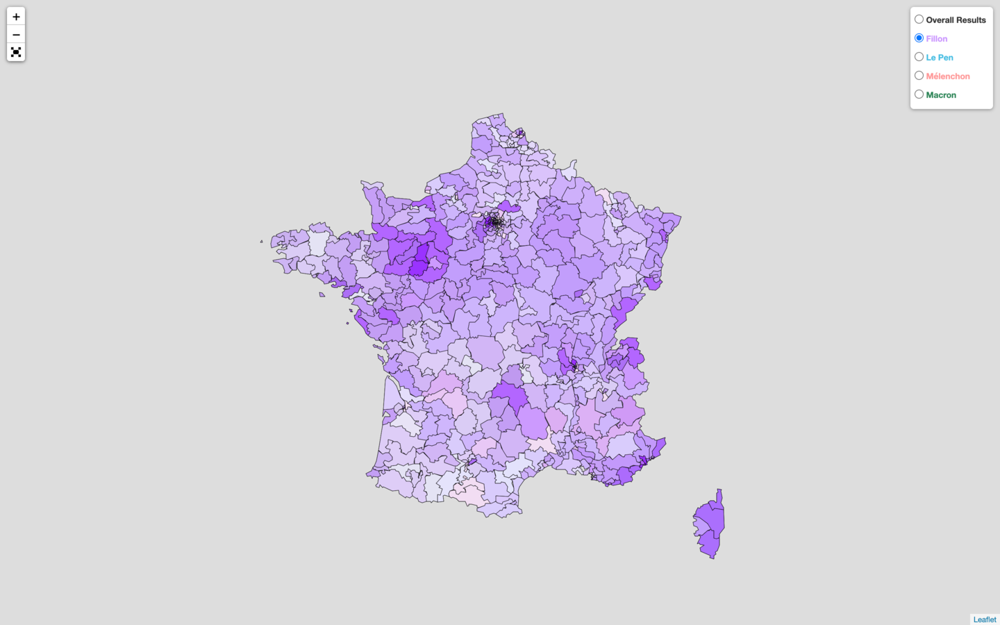
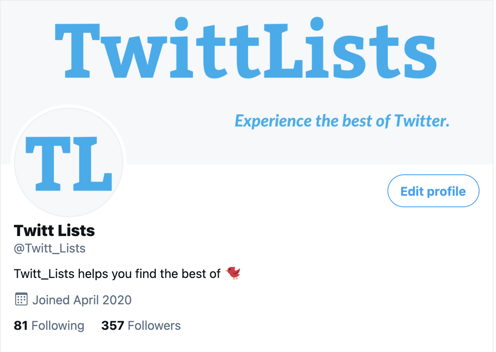
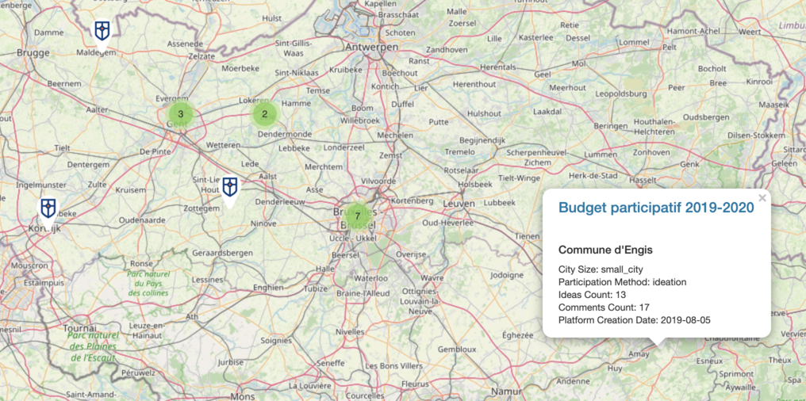
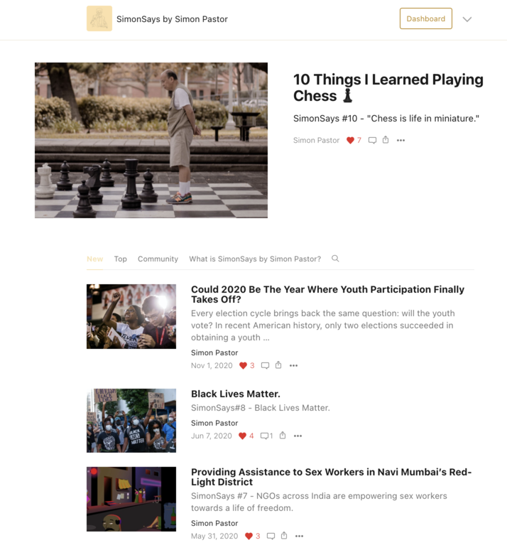

<head>

</head>
<body>

  

    <a class="active" href="https://simonpastor.com">Home</a>
    <a href="https://simonpastor.com/portfolio">Portfolio</a>
    <!-- 
 */
      <button class="dropbtn">
        <a href="#contact">SimonSays</a>
      <i class="fa fa-caret-down"></i>
      </button>
      

         <a href="#">Emperor Gaius Trump</a>
         <a href="#">Harmless Tradition or (Khat)astrophe?</a>
         <a href="#">Post-Covid Social Status:Unclear</a>
      

    
 -->
    <a href="https://simonpastor.substack.com">SimonSays</a>
    <a href="#news">Resume</a>
    <a href="https://simonpastor.com/contact">Contact</a>
  

 
  <!-- Header -->

  

Welcome to my website! I'm Simon, an LSE Government and History alumnus passionate about the intersection of Data and Politics/Policy!

  
Click on the buttons to change the grid view. Click on an image to check out the project!

  

    <button class="btn" onclick="one()">1</button>
    <button class="btn active" onclick="two()">2</button>
    <button class="btn" onclick="four()">4</button>
  

 

<!-- 

  
  

    
Click to check out!!

  

 -->

  

    

Memorable Sportspeople

    

Memorable Sportspeople

    

Delphes

  

  

    

French Presidential Elections

    

French Presidential Elections

    

French Presidential Elections

    

French Presidential Elections

  

  

    

Twittlists

    

Twittlists

    

Twittlists

  

  

    

Citizenlab

    

Citizenlab

    

Simonsays

  

</body>
